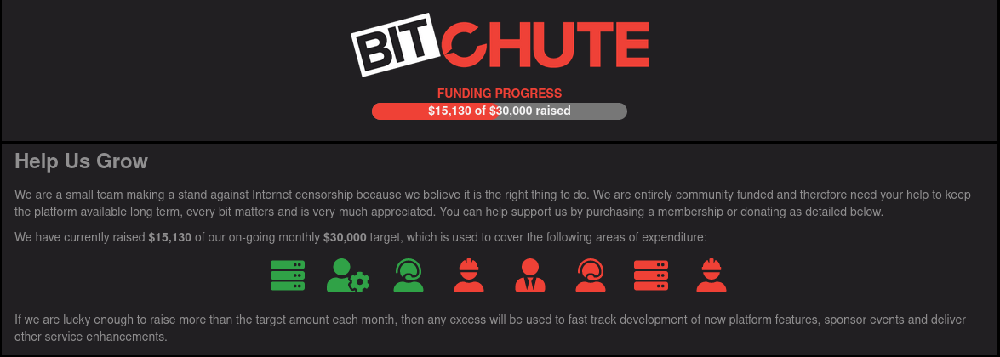

[BitChute](https://www.bitchute.com/) is a free speech, peer-to-peer video hosting platform.
The team behind BitChute describes itself as "making a stand against Internet censorship because we believe it is the right thing to do."

The platform uses a technology called WebTorrent, which means users can seed a video as they are watching it.
This not only adds a bit of decentralization, but also can somewhat reduce the infrastructure costs of running a video hosting service.

## Direct Monetization

On BitChute, content creators can choose to monetize their channels, which allows for their followers to tip them directly.
Features like this can make monetization more resilient for creators.

## Premium Membership

BitChute offers three different paid membership plans that provide various features and benefits (such as a Supporter badge and an increased number of playlists).
[Learn more](https://www.bitchute.com/membership/configure/).

## Community Funded

The BitChute project is entirely community funded.
Users can donate via [SubscribeStar](https://www.subscribestar.com/bitchute) or various crypingtocurrencies (including Bitcoin and Ethereum).
[Learn more](https://www.bitchute.com/help-us-grow/).

