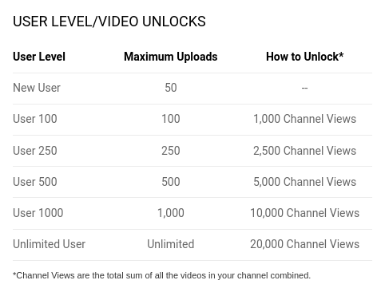

Brighteon is a free speech video hosting platform. They outline the prohibited content as: "pornography, how-to terrorism videos or other videos which may directly call for violence or violate U.S. federal law or violate intellectual property."
Brighteon also takes a relatively strong stance on privacy as well.
From their [sign up page](https://www.brighteon.com/dashboard/request-invitation):
> Brighteon does NOT track users to build user psychological profiles like Google, YouTube, Facebook and other evil tech companies. As a result, we do NOT monetize user profiles in any way. Our sole source of revenue comes from the ads displayed on video view pages and your purchases through the Brighteon Store.
>
> We do NOT display ads based on user profiles. We choose ads to display entirely based on the content of the video where the ads appear. Thus, we are not profiling users, but rather matching ads with content. This is how we respect your privacy and anonymity.

## Video Archival Mitigation

As YouTube becomes increasingly unstable, many creators are turning to alternative platforms (such as [BitChute](/alttech/bitchute)) for purely archival purposes (in other words, for "backing up" their content).
However, this puts a strain on those platforms because storing large amounts of data (such as tens of thousands of videos) is expensive, especially if that content is just sitting around and not generating activity.

Brighteon recognized this and implemented a system that only allows users to upload more videos as their viewership grows.
They are very open about this situation.
From their [January 2020 update](https://support.brighteon.com/Brighteon-update-Jan-2020.html):
> In essence, some users are using Brighteon as a video archiving / storage site, which is not its intended purpose.
> To keep Brighteon free and sustainable, we must generate sufficient views to help encourage product sales at BrighteonStore.com, which funds the Brighteon operation.

