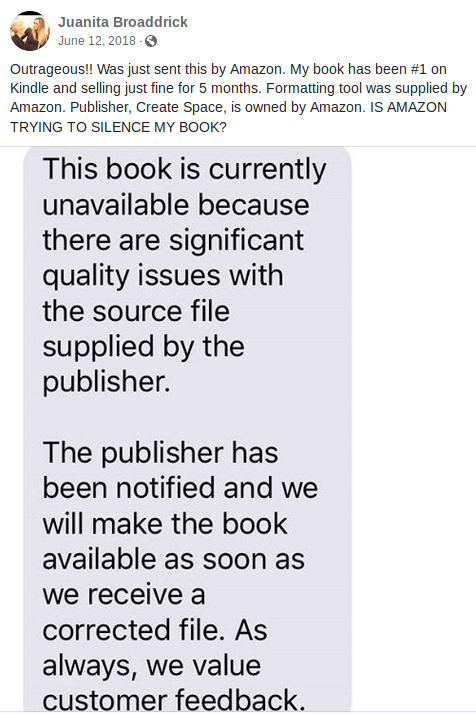

The day after Bill Clinton said "norms have changed in terms of what you can do
to somebody against their will" [in an interview](https://archive.is/0tQZo),
Amazon removed the digital version of Juanita Broaddrick's book about how Bill
Clinton allegedly raped her. Below is the [Facebook
post](https://www.facebook.com/photo.php?fbid=10156193525011013) Broaddrick
made regarding Amazon removing the book:

