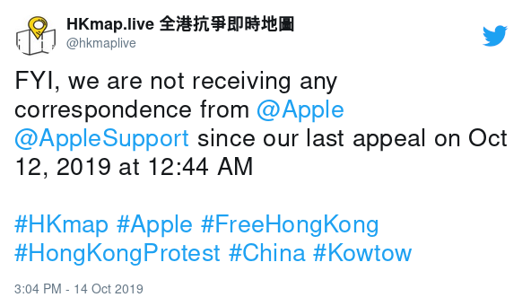

[HKmap.live](https://hkmap.live/) is an app that helps people in Hong Kong track police presence and protestors.
The iOS app was removed from the App Store the day after Apple received heavy criticism from the Chinese Communist Party's official news outlet, the People's Daily.

Apple claimed in a statement that it was used to "ambush police" and "threaten public safety."
There of course was no evidence to support this claim, and Apple was not responsive with the developers:

[(archived)](https://web.archive.org/web/20191015001121/https:/twitter.com/hkmaplive/status/1183866217808793600)

HKmap.live can still be used via [its web app](https://hkmap.live/).
