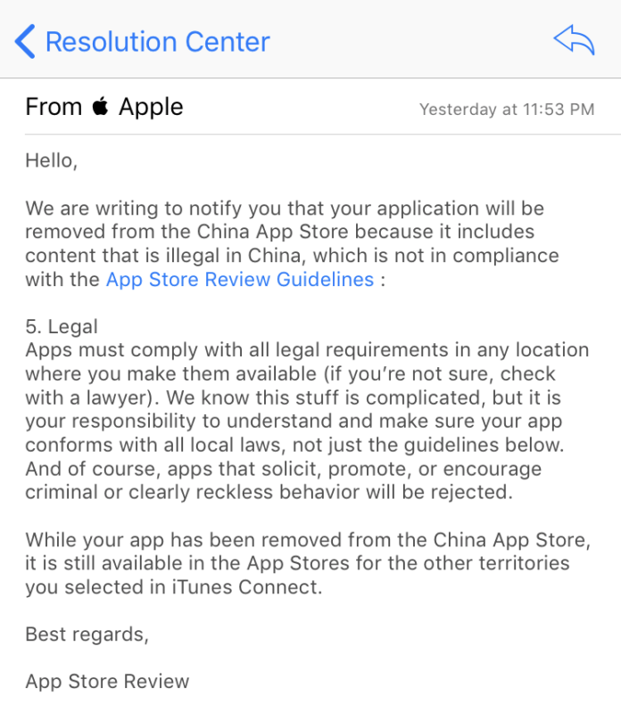

News broke on July 29th via an [ExpressVPN blog post](https://www.expressvpn.com/blog/china-ios-app-store-removes-vpns/) which explained that Apple had removed all major VPN apps from the China App Store.
From the blog post:
> We’re disappointed in this development, as it represents the most drastic measure the Chinese government has taken to block the use of VPNs to date, and we are troubled to see Apple aiding China’s censorship efforts.
> ExpressVPN strongly condemns these measures, which threaten free speech and civil liberties.

Below is the notice ExpressVPN received from Apple:

This move by Apple comes about six months after the Chinese government's Ministry of Industry [made VPNs illegal](https://thehackernews.com/2017/01/china-firewall-vpn.html).
