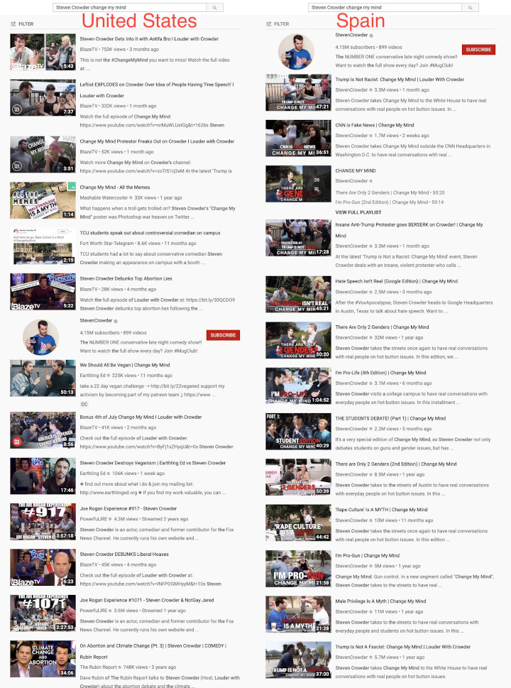

Throughout the month of September 2019, Louder With Crowder experienced sharp declines in certain YouTube channel analytics.

Near the end of the month, Steven Crowder started releasing content showing that this was the result of a shadow ban.
Specifically, he [released a YouTube video on September 28th](https://www.youtube.com/watch?v=BKDeOybpV08) detailing two key points regarding the channel analytics:
1. There was a drop in the views and organic subscriptions from search.
2. The views on all of the channel's videos were still growing.

Also in the video are [multiple screen recordings](https://youtu.be/BKDeOybpV08?t=202) of users making basic searches on YouTube.
All show that the first _several pages of search results_ (for searches such as "steven crowder" and "steven crowder change my mind") contain absolutely no videos from Crowder's channel.

At this point, this was assumed to be just a general shadow ban.

However, on September 30th, Crowder published [this tweet](https://twitter.com/scrowder/status/1178837180514353152) and [this YouTube video](https://www.youtube.com/watch?v=KBPXe09Ca-s) detailing the deeply disturbing situation:
that this shadow ban was only in effect for the US.

As the image below shows, and as Crowder details in his video and tweet, the search results for Spain contain _**only**_ videos from his channel, whereas the search results for the US contain _**no**_ videos from his channel.

So, what happened?
Well, Crowder and his team accumlated more than enough evidence and this whole thing got enough attention that everything kind of just went back to normal (for now).

However, in his [September 25th video](https://www.youtube.com/watch?v=CTCZuy4gMho), Crowder highlights one of the broader implications of this shadown ban:
> So right now we're really talking about the search algorithms, the organic traffic, and them trying to sway the election results for 2020.
> It's not just about our channel, but if they can do what they've been doing to our channel, ... they're going to do it with anyone they deem to be a threat.

Those are some words that would prove shockingly foretelling [about three weeks later...](/e/youtube-gets-caught-shadow-banning-tulsi-gabbard-in-the-us/)
