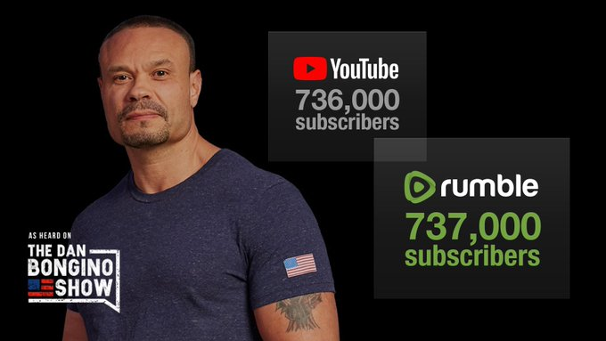

Dan Bongino, a political commentator and author, surpassed his YouTube
subscriber count on Rumble (an alternative video hosting platform of which
Bongino is a part-owner). This happened at about the 736k subscriber count.

> THANK YOU! We sent a huge message to the tech tyrants.
>
> In just three months on Rumble we blew past our subscriber count on YouTube.
> It’s happening. And you’re a part of it. We’re not going to sit back and take
> it anymore.
> 
>
> -- Dan Bongino (@dbongino) [8 Dec 2020](https://archive.is/nBe1E)

At the time of this writing, Bongino had the largest channel on Rumble but was
still averaging less views per video on Rumble vs YouTube.
