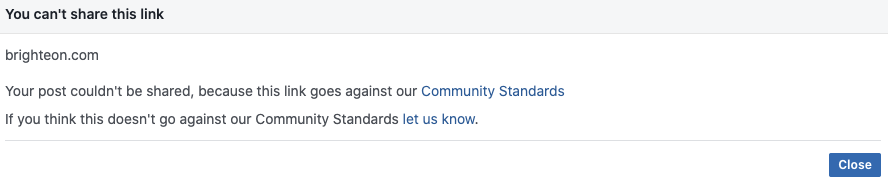

Facebook started blocking the ability for users to share links to [Brighteon.com (a video hosting site)](/alttech/brighteon/) and NaturalNews.
From [Reclaim The Net](https://archive.vn/hSatA#selection-405.0-412.1):
> As of the time of writing, trying to link to any video on Brighteon results in the following message:
> 

This came shortly after the "Plandemic" documentary, which was [scrubbed from several major platforms](http://localhost:1313/events/youtube-and-facebook-remove-plandemic-part1/), including Facebook, went viral on Brighteon.
