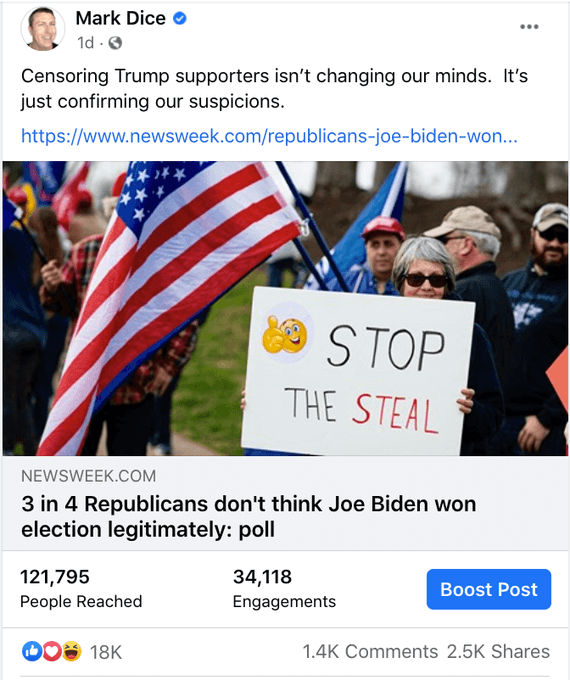

Facebook removed a post made by media analyst and political
commentator Mark Dice, restricted the distribution of his page, and threatened
to outright ban him:

> Facebook messaged me saying they might ban me after they took down another
> post where I said, "Censoring Trump supporters isn’t changing our minds.
> It’s just confirming our suspicions.” 🤡
>
> -- Mark Dice (@MarkDice) [24 Jan 2021](https://archive.is/nvgbG)

> Here's the post they censored, which linked to a Newsweek article.  Their OCR
> may have detected the picture (from the article) containing the phrase that
> shall not be said.
>
> 
>
> -- Mark Dice (@MarkDice) [24 Jan 2021](https://archive.is/AjVom#selection-1429.0-1429.172)
