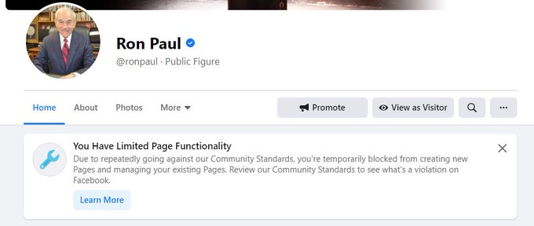

Facebook restricted Ron Paul from creating new pages and managing
his existing pages without citing a specific reason why. The notice on his
account said it was "Due to repeatedly going against [Facebook's] Community
Standards [...]", however, Ron Paul has never had any community standards
violations.

> With no explanation other than "repeatedly going against our community
> standards," @Facebook has blocked me from managing my page. Never have we
> received notice of violating community standards in the past and nowhere is
> the offending post identified.
> 
>
> -- Ron Paul (@RonPaul) [11 Jan 2021](https://archive.is/G1xF5)

This move by Facebook came right aftr Ron Paul posted content that was critical
of tech censorship. Later that day, Facebook lifted the restrictions and said
in an email to _Reason_ that the restrictions were placed on his account in
"error." Two days later, Ron Paul [announced](https://archive.is/Olm9s) that
his content is now on **LBRY.tv** & **Odysee**!

> Looking for new ways to watch the The Ron Paul Liberty Report?
>
> You can now find the show on [LBRY.tv](http://LBRY.tv) and Odysee!
>
> [lbry.tv/@RonPaul](https://lbry.tv/@RonPaul)
>
> [odysee.com/@RonPaul](https://odysee.com/@RonPaul)
>
> -- Ron Paul (@RonPaul) [13 Jan 2021](https://archive.is/Olm9s)
