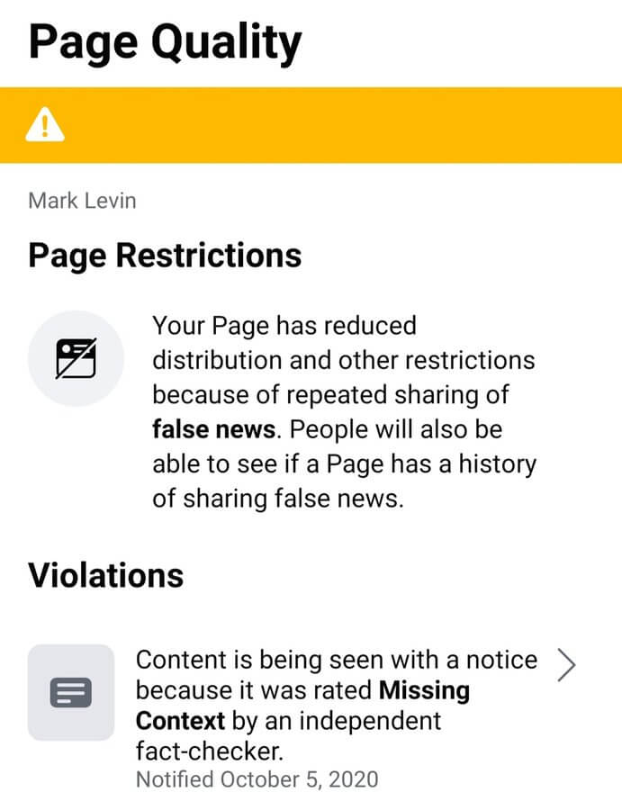

Facebook restricted Mark Levin's page [due to](notice.jpg) "repeated sharing of
false news." At the time of this writing, Mark Levin's [Facebook
page](https://archive.is/6p1w2) has over 1.5 million followers, and his radio
show is [one of the most highly rated](https://archive.is/N9BH5) talk shows in
the US.
> Facebook has just sent us this message. It’s a clear effort at censorship.
> Every link I post is from a legitimate source. But because so many people are
> seeing what I’m posting and we’re within weeks of the election it’s clear
> that Facebook is trying to influence the election’s outcome. It’s also clear
> Facebook is pushing a leftwing agenda. I’ll address this tonight on radio.
> 
>
> -- Mark Levin (@Marklevinshow) [5 Oct 2020](https://archive.is/zb3N0)
