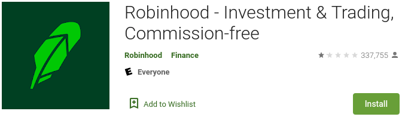
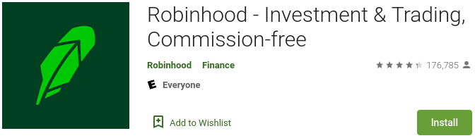

The [Google](/google/) Play Store purged over 150,000 negative reviews from
Robinhood, one of the most popular trading apps. These reviews poured in after
Robinhood restricted the ability to buy certain stocks (like GameStop) that
were selected by the online trading group r/wallstreetbets as targets for
massive short squeezes. The reviews peaked on January 28th when Robinhood had a
**1-star rating based on 337,755 total reviews**. Over the next day, reviews
were purged by the tens of thousands until the app was back to a **4-star
rating based on only 176,785 total reviews**. [Reclaim The Net
reported](https://reclaimthenet.org/google-play-removes-robinhood-reviews/):

> These negative reviews pushed the overall rating for the Robinhood app in the
> Google Play Store down from an overall rating of 3.5 stars to 1 star.
>
> But now, Google has stepped in and purged over 150,000 negative reviews.
> After Google scrubbed these dissenting reviews, Robinhood’s unfavorable 1
> star rating was transformed into a positive 4 star rating.

Below are screenshots (from web archives) of the Robinhood app in the Google
Play Store before and after the review purge.

[28 Jan 2021 20:26:56 UTC](https://archive.is/Tv6My) :

[29 Jan 2021 12:28:56 UTC](https://archive.is/Tv6My) :

[An archive](https://archive.is/sZGBm) from January 31st (a couple days later)
shows the app was back down to a 1-star rating with over 250k reviews,
indicating either that Google is letting some of the reviews stand or that they
can't hold back the amount of users leaving negative reviews.
