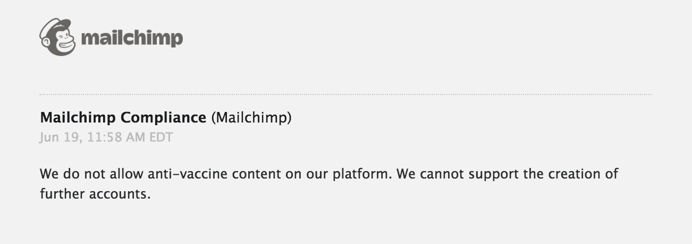

Mailchimp banned [_GreenMedInfo_](https://www.greenmedinfo.com/page/about-us),
an online natural medical resource, because they sent out "anti-vaccine
content." Their mailing list had **300k members**.

> On the morning of June 19th, without warning nor specifying a reason,
> Mailchimp sent us an email informing us our account had been disabled. When
> we inquired as to the reason why, they responded as follows:
> 
