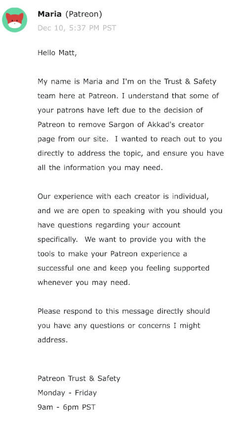
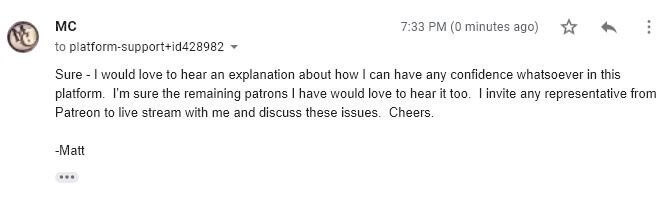

Patreon's [banning of Sargon on December 7th](/e/patreon-bans-sargon/) caused immediate and significant losses for other creators on the platform.

Matt Christiansen, in particular (as of December 20th), had lost 39% of his total Patrons, equating to a 42% loss of his total monthly income via Patreon.
That's nearly half of his support that vanished in less than two weeks time.

However, Patreon was already in panic mode before this.
On December 10th, just three days after the Sargon ban, Patreon reached out to Matt Christiansen, **unsolicited**, to discuss the Sargon ban.
Matt responded less than two hours later expressing interest in talking with anyone from Patreon.

After **a week** of radio silence from Patreon, they finally responded on the 18th and scheduled a phone call for the 20th.

In this phone call, Matt gave Patreon _more than enough_ rope to metaphorically hang themselves a hundred times over.

The phone call is best detailed [by Matt in a BitChute video](https://www.bitchute.com/video/Hv7hvZee-PQ/), where he points out the three key takeaways.
Quoting from the video:

> **First**, that explicitly, by Jacqueline's description, Patreon is not a free speech platform.
> **Second**, that explicitly, by Jacqueline's description, Patreon is not a free market.
> And **third**, explicitly, by Jacqueline's description, rules enforcement on Patreon is subjective, by design.
> If you take nothing else away from this video, I want you to remember those three things.

(The transcript of the phone call is available [here on Reddit](https://www.reddit.com/r/podcasting/comments/a8nexc/transcript_from_phone_call_between_matt/) and [here on Google docs](https://docs.google.com/document/d/1U0mQjUA0T5INc_GDkwPJ2mfhO7tbaIogisSqqxHw0hc/edit).)
