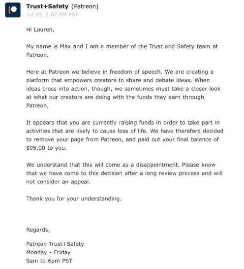

Lauren Southern was banned from Patreon without warning or possibility for appeal.
In the letter Lauren received from Patreon, they allege that she is "raising funds in order to take part in activities that are likely to cause loss of life."
They provided no evidence to support this claim.
Here is the notice Lauren received from Patreon:

As Lauren states in [the video](https://www.youtube.com/watch?v=rtImwK5TI4g), she did not "take part" in the Defend Europe mission, something that has no intention of harming other people.
Quoting Lauren's summary from her video:
> Now, I assume that you guys are talking about the Defend Europe mission, a mission that, **firstly**, I am not actually taking part in.
> I was planning on joining them on the boat initially, ..., but I decided a professional crew member with more experience should take my place instead.
>
> **Secondly**, not a dime that I got from Patreon went towards the Defend Europe mission.
> All of the money I get from Patreon goes towards my initial stated goals, which were entirely within the Patreon guidelines.
>
> And **thirdly**, and probably the most important point, even if I were taking part in the Defend Europe mission, and I were raising money for it through Patreon, it is not a mission with any intentions to cause the loss of life.
