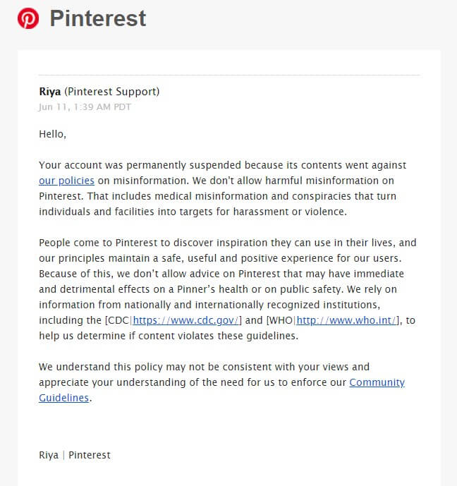

Pinterest banned pro-life group LiveAction on the same day that [Project Veritas revealed](/events/pinterest-caught-shadow-banning-conservative-content/) that the platform shadow bans conservative content, in particular Christian and pro-life content.

Below is the message LiveAction received from Pinterest regarding their ban:

