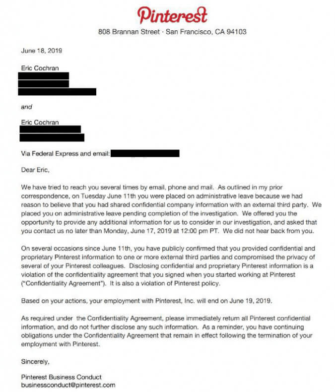

Whistleblower Eric Cochran was escorted out of Pinterest and placed on administrative leave on June 11th, the same day that [Project Veritas published their report](/events/pinterest-caught-shadow-banning-conservative-content/) containing the documents Cochran leaked to them.

He was later fired on June 19th. Below is the letter he received from Pinterest regarding his termination:

Later, on July 2nd, [Cochran joined Project Veritas](https://www.projectveritas.com/2019/07/02/pinterest-insider-joins-project-veritas/), saying:
> I’ve decided to work with Project Veritas because I want to continue to make a positive impact in our country and culture.
> Insiders will play a major role in exposing the injustices of our world and they’ll help hold the most powerful Big Tech and other organizations accountable for their actions.
> I am looking forward to emboldening more insiders to speak the truth.
