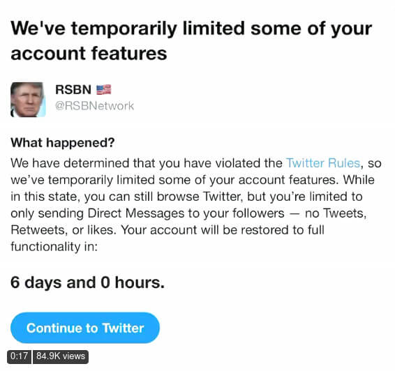

Twitter gave _Right Side Broadcasting Network_, a right-wing news outlet, three
consecutive suspensions without providing a reason or explanation. The first
two suspensions were for **12 hours each** and were followed by **a six day
suspension**. There was no time in between these suspensions and none of them
provided any reason or insight as to why Twitter issued them. In fact, in the
[first suspension notice](specifically-for-blank.jpg) where you would see a
stated reason, it **says "Specifically for:" followed by nothing**.

> The @RSBNetwork has now been suspended for SIX days!? And we still don’t know
> why or have a reason.
>
> We’ve waited out two 12 hour suspensions and then it says our account is
> fully restored...but when we click “continue to Twitter”, this happens:
> 
>
> -- Joe Seales (@JoeSeales) [20 Jan 2021](https://archive.is/bAIkz)

_RSBN_ is [on Telegram!](https://t.me/RSBNetwork)
