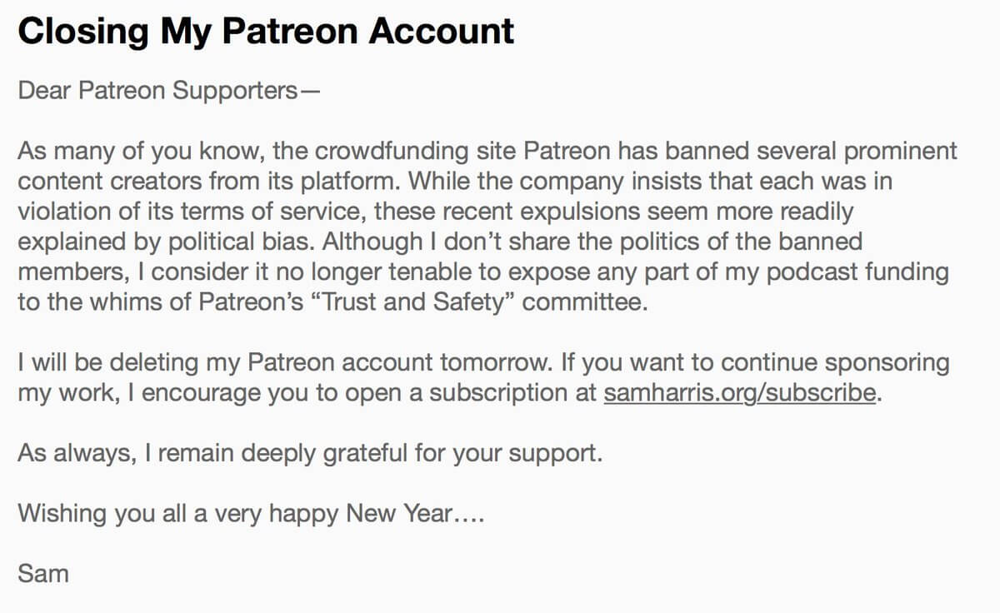

After Patreon banned several members for wrongthink, Sam Harris decided to protect himself and his funding by deleting his Patreon account.

From [his letter](leaving-patreon-letter.jpg): "...I consider it no longer tenable to expose any part of my podcast funding to the whims of Patreon's "Trust and Safety" committee."

In November of 2018, Harris had the [11th largest overall](https://graphtreon.com/monthly-ranking#Nov2018) Patreon account and the [4th largest 'Podcast' account](https://graphtreon.com/monthly-ranking#Nov2018).
