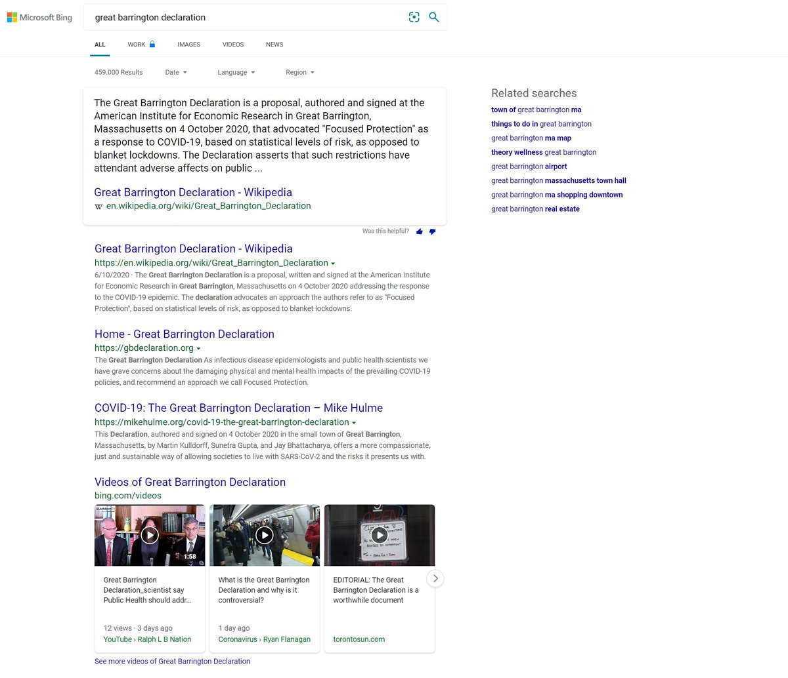
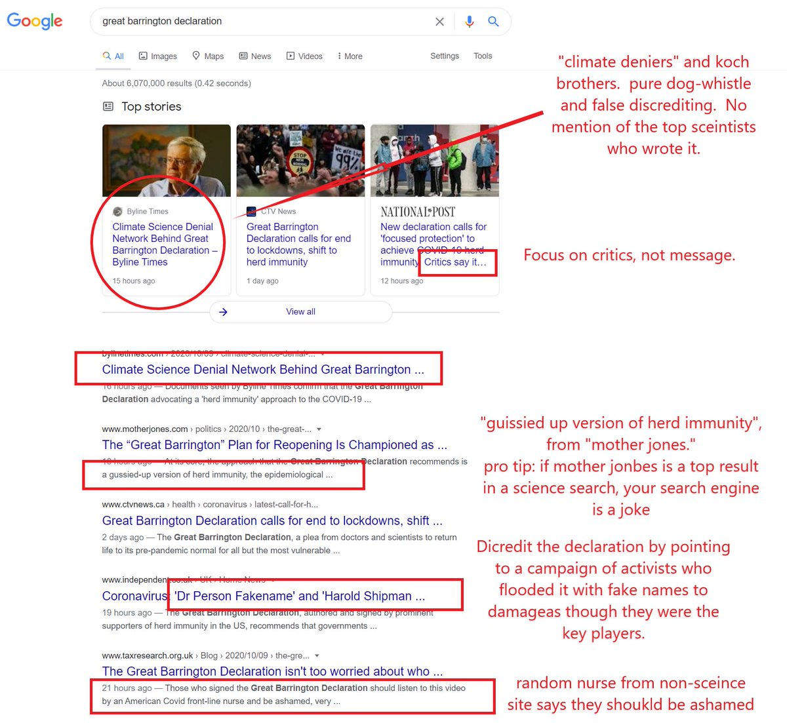

On October 4, 2020, a group of doctors published _The Great Barrington
Declaration_. It was essentially a statement recommending different methods of
dealing with the "pandemic" instead of locking people down and shutting down
businesses. Over the next few days, it [amassed over 100k
signatures](https://archive.ph/9Y330#selection-1099.0-1103.73). It [opens with
the following](https://archive.ph/OkOwy#selection-2303.0-2307.569):

> The Great Barrington Declaration – As infectious disease epidemiologists and
> public health scientists we have grave concerns about the damaging physical
> and mental health impacts of the prevailing COVID-19 policies, and recommend
> an approach we call Focused Protection.
>
> Coming from both the left and right, and around the world, we have devoted
> our careers to protecting people. Current lockdown policies are producing
> devastating effects on short and long-term public health. The results (to
> name a few) include lower childhood vaccination rates, worsening
> cardiovascular disease outcomes, fewer cancer screenings and deteriorating
> mental health – leading to greater excess mortality in years to come, with
> the working class and younger members of society carrying the heaviest
> burden. Keeping students out of school is a grave injustice.

A day or so later, a link to the declaration appeared in both the
[r/COVID19](https://archive.ph/VMfFG) and
[r/Coronavirus](https://archive.ph/rFx9c) subreddits and [was promptly
removed](https://archive.ph/9Y330) from both. This doesn't appear to have had
anything to do with Reddit itself since there is a post that remains up [on the
r/LockdownSkepticism](https://www.reddit.com/r/LockdownSkepticism/comments/j5iqps/great_barrington_declaration_an_open_letter_and/)
subreddit.

However, a few days later, people started noticing that Google was heavily
censoring the search resuts for _The Great Barrington Declaration_. The
propagandized results didn't even contain the declaration itself. They instead
contained smears and lies about the declaration and the people behind it.
Twitter user **@boriquagato** (now suspended) published a great thread which in
part contained screenshots of Google's results vs Bing's, as shown below:

> from the "make orwell fiction again" files:
>
> google has memory holed the great barrington declaration
>
> not only have they wiped it from the top results, they have salted it with
> false claims about "climate denial"
>
> it's pure, simple propaganda
>
> here's bing (who plays it straight)
>
> 
>
> -- el gato malo (@boriquagato) [10 Oct 2020](https://archive.ph/hQKj3)

> the google results for "great barrington declaration" are simply not search
> results at all.
>
> it's a propagandistic hit piece ducking the science, ignoring the credentials
> of the authors, failing to show the declaration, and spinning it as some kind
> of fringe cabal of "deniers."
>
> 
>
> -- el gato malo (@boriquagato) [10 Oct 2020](https://archive.ph/hQKj3#selection-116915.0-116915.278)
