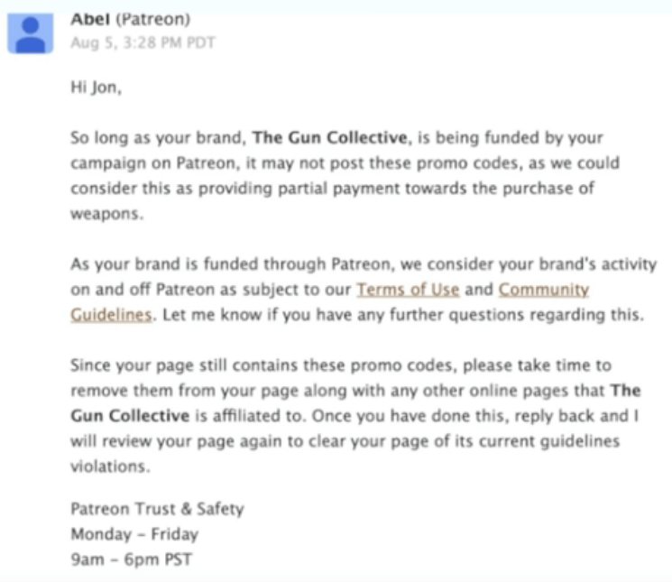

This all started around the beginning of August 2019 when Patreon told TheGunCollective that discount and promo codes for guns are considered "partial payments" in the "procurement of weapons."
Therefore, any of TheGunCollective's content on Patreon containing these promo codes would be in violation.

On August 2nd, Jon Patton of TheGunCollective [released a YouTube video](https://www.youtube.com/watch?v=Zw9seqXYfRY) detailing the communication exchange up until that point.

However, later on August 5th, as the email exchange continued, Patreon responded with a very alarming message:

To emphasize, the alarming part of the message is:
> As your brand is funded through Patreon, we consider your brand's activity on and off Patreon as subject to our Terms of Service and Community Guidelines.

On August 21st, after a couple of weeks of exploring different options, TheGunCollective [released a YouTube video](https://www.youtube.com/watch?v=Zw9seqXYfRY) officially announcing the transition from Patreon over to SubscribeStar.

In the video, Jon Patton made a good point that's worth highlighting here. He implored all the other gun communities that are funding through Patreon to protect themselves by leaving the platform:

> I am pleading with every gun channel out there, every gun media outlet, that is currently funding through Patreon, to pull the plug on this BS.
> The fact that they're trying to control what we're doing, on and off the platform, is a big deal.

Even though TheGunCollective's Patreon account is still active, they are encouraging everyone to favor supporting them through SubsribeStar instead.
In fact, [on their SubscribeStar account](https://www.subscribestar.com/theguncollective), TheGunCollective set up a goal tracker to indicate their progress towards dropping Patreon once and for all.
