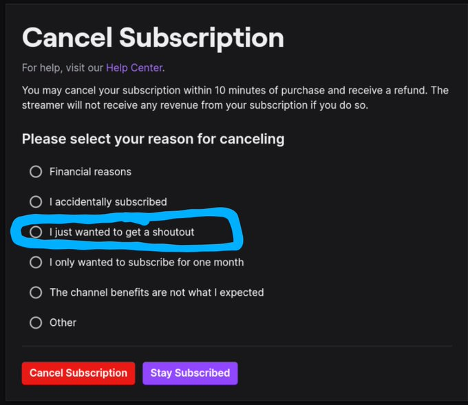

[Twitch](/twitch/) is an online streaming platform, owned by
[Amazon](/amazon/), where users can "subscribe" to their favorite streamers by
paying a monthly subscription fee in exchange for various perks. Typically when
someone subscribes, the streamer will thank that person on stream. Twitch
offers users the ability to terminate their subscription and refund them the
subscription fee they paid.

In addition to the existing reasons that users might want a refund for
subscribing (such as "I accidentally subscribed"), Twitch added **"I just
wanted a shoutout"**, meaning someone could subscribe just to be thanked on
stream and then unsubscribe and get a refund within ten minutes, making it
easier than ever for people to troll streamers:

> Twitch: we are doing our best to protect our streamers from trolls
>
> Also Twitch: here ya go trolls, here's another zero cost way to troll the
> streamer
>
> And yes, I confirmed it works. It's not just a jebait option.  I got a refund
>
> One step forward, two steps back
>
> 
>
> -- Sidequest | Tiny (@TalesOfTiny) [8 Mar 2021](https://archive.is/HCyKo)
