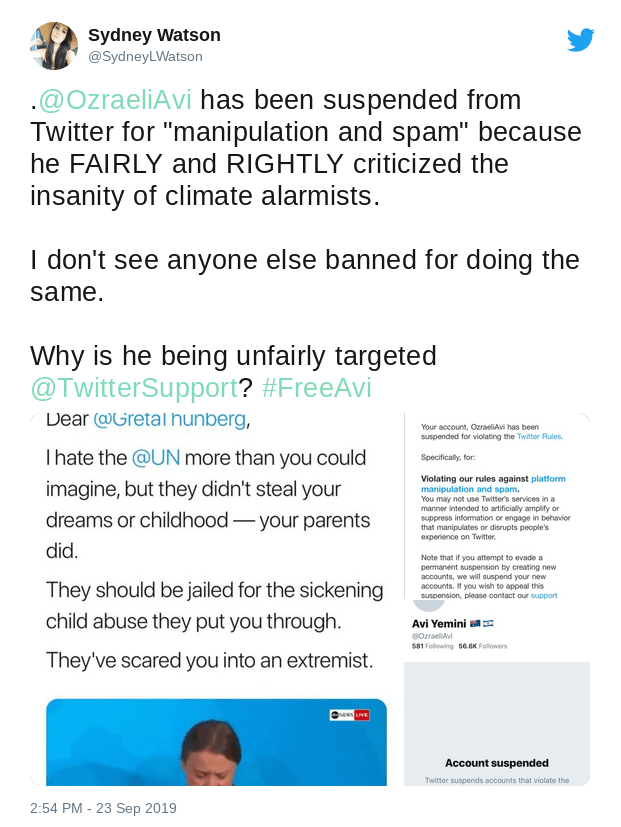

Avi Yemini was permanently banned from Twitter after publishing a tweet that was critical of Greta Thunberg's parents:

> Dear @GretaThunberg,
>
> I hate the @UN more than you could imagine, but they didn't steal your dreams or childhood — your parents did. 
>
> They should be jailed for the sickening child abuse they put you through.
>
> They've scared you into an extremist.
>
> -- Avi Yemini (@OzraeliAvi) [23 Sep 2019](https://web.archive.org/web/20190923205443/https:/twitter.com/OzraeliAvi/status/1176234521399676928)

After significant backlash, and a very [successful #FreeAvi campaign](https://www.tr.news/twitter-reinstates-avi-yemini/), Avi's account was reinstated about two days later:

> WOW! The #FreeAvi campaign worked. 
>
> Thank you all!! ❤️❤️
>
> I’ve lost some followers in the process, so please RT this to let them know I’m back.
>
> Let the triggering begin!
>
> -- Avi Yemini (@OzraeliAvi) [23 Sep 2019](https://web.archive.org/web/20190925204614/https://twitter.com/OzraeliAvi/status/1176960044711022592)
