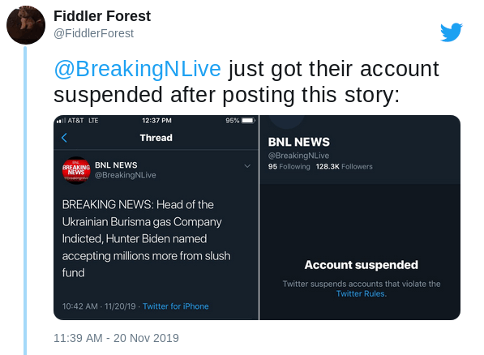
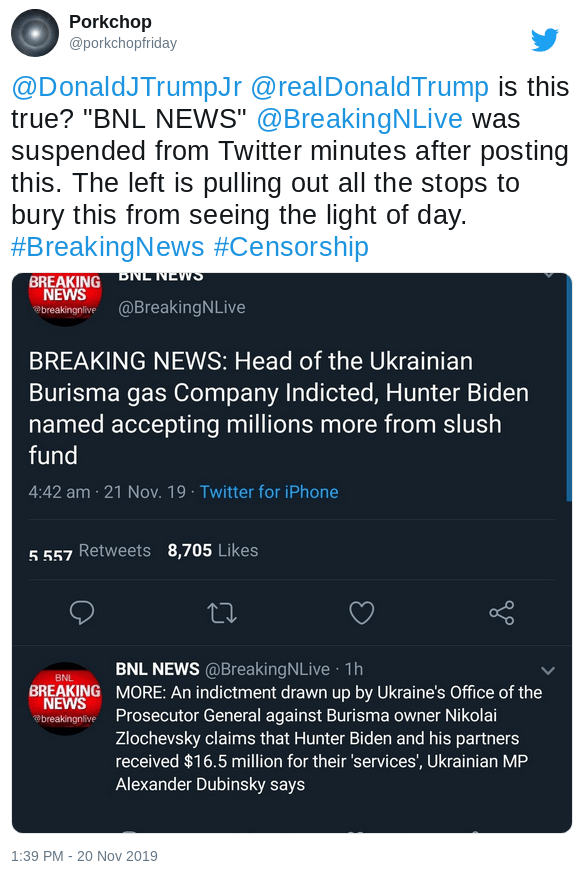

Twitter banned **@BreakingNLive** for being "spam" after they tweeted out a link to a Biden-Ukraine article on ZeroHedge.com.
The account had approximately 120k followers at the time.

[The ZeroHedge article](https://www.zerohedge.com/geopolitical/ukrainian-indictment-reveals-hunter-biden-group-made-165-million-mp), which detailed leaked information from Ukraine about the Bidens and Burisma, opens with:
> A Ukrainian MP says a document leaked from the Ukraine's Office of the Prosecutor General contains claims against Burisma owner Nikolai Zlochevsky,
> as well as Hunter Biden and his partners - who allegedly received $16.5 million for their 'services' - according to Alexander Dubinsky of the ruling Servant of the People Party.

Twitter suspended BNL shortly after tweeting a link to this article:

Styxhexenhammer666 released a video detailing this (among other damaging Biden news).
Quoting Styx [from the video](https://www.bitchute.com/video/A9UI-AAeOmA/):
> They're breaking the news specifically because BNL is a pool of journos from different backgrounds that are capable of coming together to conglomerate material.
> This kind of confederated sort of syndicated system is what really really frightens, by the way, the legacy media.
