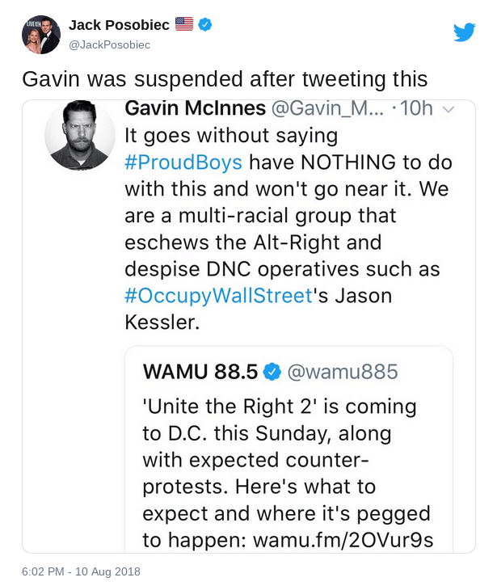

The day after Gavin and the Proud Boys disavowed "Unite the Right 2" (an
alt-right rally to be held in Washington DC), Twitter banned him as well as
several other accounts related to the Proud Boys.

This was an attempt by BigTech to tie Gavin and the Proud Boys to
white-supremacist, alt-right movements and thereby set a false narrative. This
pattern supports Alex Jones's claim that BigTech will ban you so that you can't
defend yourself when they proceed to smear and defame you.

