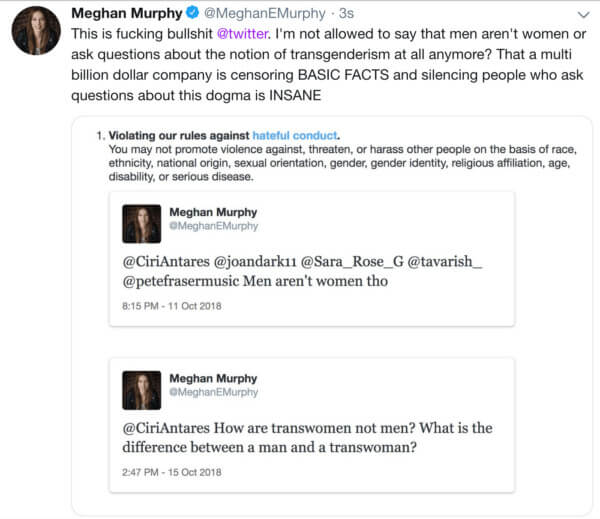

After being repeatedly suspended and unsuspended from Twitter, Meghan Murphy was finally perma-banned for the high crime of misgendering.

Murphy recaps this saga in much more detail, both [in a blog post on her site](https://www.feministcurrent.com/2018/11/20/twitter-wants-shut-right-wants-join-dont-think-either/) and [in a YouTube video](https://www.youtube.com/watch?v=sqRyAoSzGrI), than can be done here, and it is highly recommended to checkout both of those (as this here is just a brief summary).

Essentially, on several occasions, Twitter held Murphy's account hostage until she deleted specifc tweets that Twitter claimed violated their "rules against hateful conduct."
This happened at least twice in August and at least twice in November.

One of the tweets that Twitter required Murphy to delete was the now-famous "Men aren't women tho" tweet:

Late on November 23, Twitter permanently suspended Murphy's account for a tweet saying "Yeaaah, it's him" in reference to a male who identifies as a female.

In her article, Murphy highlights the disturbing imbalance of Twitter's enforcement of their own policies:
> What is insane to me, though, is that while Twitter knowingly permits graphic pornography and death threats on the platform (I have reported countless violent threats, the vast majority of which have gone unaddressed), they won’t allow me to state very basic facts, such as “men aren’t women.”
