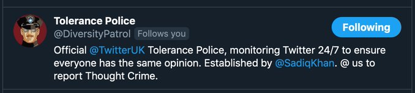

Twitter banned the satirical account Tolerance Police (@DiversityPatrol) as
part of a [satire purge](https://archive.is/oBmiV#selection-475.36-475.178)
that was carried out over the course of a few days:
> Man down - @DiversityPatrol
>
> Power shall not be mocked. There is a US election coming and naughty UK
> accounts must be silenced. That's how desperate they look to me.
>
> 
>
> -- Minitrue⁺ (@banthebbc) [18 Aug 2020](https://archive.is/q2Rc7)

The Tolerance Police [joined
Parler](https://parler.com/profile/DiversityPatrol) shortly after the Twitter
ban and issued the following [statement](https://archive.is/9SBBe) there:
> Following Far-Right issues with our Twitter account, which we can only assume
> are the result of a Hard-Right Nazi Tommy Robinson (not his real name)
> inspired Hack Attack of Hate, we’ve now moved over to the Alt-Right Parler,
> which Chief Khan informed us very worryingly describes itself as a ‘free
> speech platform,’ which we must put a stop to. 
>
> We would like to reassure all Citizens that, despite what has happened on
> Twitter our Re-Education Centres are still open and we’re as active and as
> eager to capture Thought Criminals as ever! All Hail JezSoc!
>
> Diversity Is Our Strength!
>
> Your friendly Tolerance Police Team.
