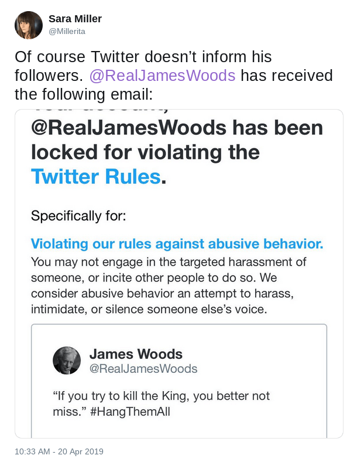

Twitter held James Woods' account hostage until he deleted a tweet that
paraphrased a quote from Ralph Waldo Emerson:
> "If you try to kill the King, you better not miss." #HangThemAll

The tweet was in the context of the Mueller report finding no collusion between
President Trump's 2016 campaign and the Russian government. Regardless, this is
clearly a paraphrasing of the Emerson quote:
> When you strike at a king, you must kill him.

His girlfriend posted a screenshot of the notice he received from Twitter:

Woods refused to delete the tweet, so Twitter did it on their own. A few weeks
later, Woods [announced](/events/james-woods-quits-twitter/) that he was
quiting Twitter.
