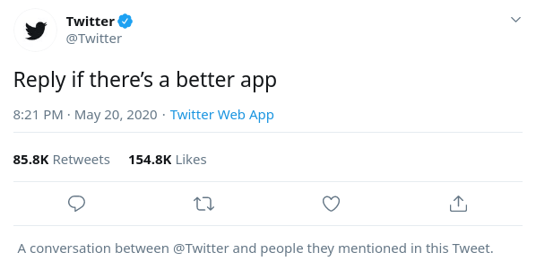

Twitter starting rolling out the new feature of stifling conversation, which
[they had announced](/events/twitter-unveils-plans-to-limit-replies/) in the
beginning of the year, to certain users for initial testing.

Styxhexenhammer666 [said it best](https://www.bitchute.com/video/VPDZGVtyeu0/):
> This is a way of allowing vapid celebrities and idiot politicians to say dumb
> sh\*t and nobody can actually point out, you know, "Acutally, you're wrong.
> You're a piece of sh\*t."
