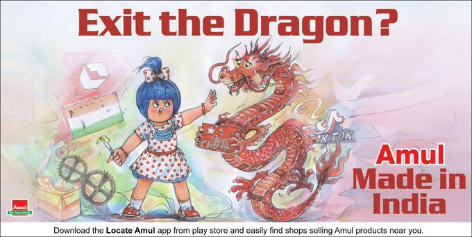

Twitter suspended the account of Amul, an Indian dairy company, the day after
it posted the following tweet suggesting the boycott of Chinese products in
favor of those made in India:
> [#Amul](https://twitter.com/hashtag/Amul) Topical: About the boycott of Chinese products...
>
> 
>
> -- Amul.coop (@Amul_coop) [3 Jun 2020](https://archive.vn/q9OP6)

Twitter did not initially give any reason or explanation for the suspension
which coincidentally came as border tensions between India and China had been
escalating.

The account was reinstated the following day, and a Twitter spokesperson [told
Wion News](https://archive.vn/zpOwm#selection-691.35-691.307) the following:
> The account was caught in our spam filter. Safety and security of the
> accounts is a key priority for us and sometimes to ensure an account has not
> been compromised we require the account owner to complete a simple reCAPTCHA
> process also termed as an 'anti-spam' challenge.
