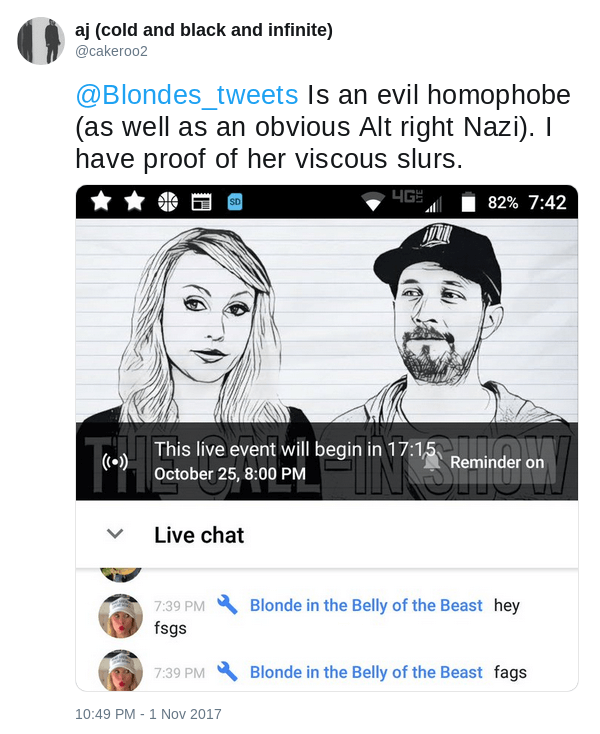

Twitter gave Blonde (aka. _Blonde in the Belly of the Beast_) a one week suspension for saying the word "faggot" in a joking response to a funny, trolling tweet by one of her followers.

One of her followers made the following sarcastic tweet because Blonde had greeted her stream's live chat with "hey fags":

Blonde jokingly replied by saying "Stop being a faggot, faggot", which everyone involved understood to be a hilarious response.
Some unknown user, who was **not involved in any way whatsoever**, reported this to Twitter, and Blonde was then suspended for one week.
