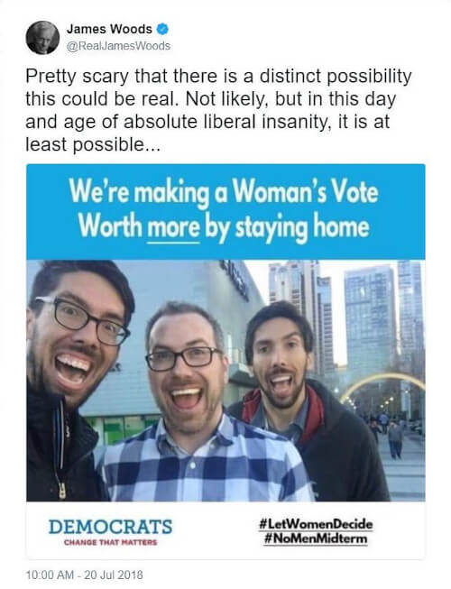
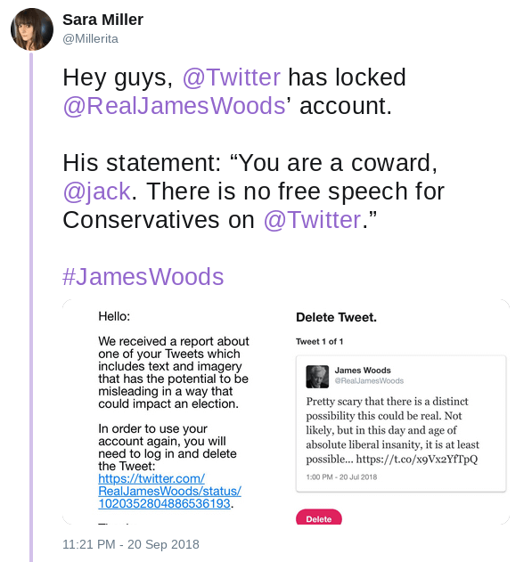

Twitter temporarily suspended James Woods for the following two month old tweet that they claimed was "misleading in a way that could impact an election":

His girlfriend posted screenshots of the notice he got from Twitter as well as his statement on the matter:

To not only take this tweet so seriously, but also claim that it could impact an election, really shows the nature of the higher-ups at Twitter.
