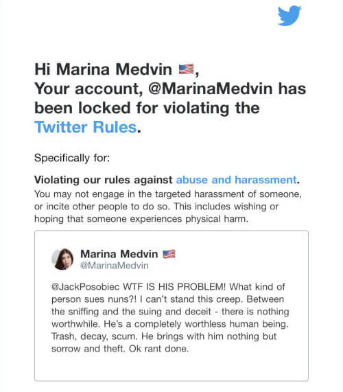

Twitter temporarily suspended [Marina Medvin](https://www.medvin.me/), a senior
columnist for Townhall, after she criticized Biden for suing nuns. As she
[reported](https://archive.is/7X2U5#selection-1203.51-1203.597):
> Some leftist with a mute button working for corporate Twitter deemed me in
> violation of Twitter's "abuse and harassment" policy. Twitter claimed I
> committed "targeted harassment" by "wishing or hoping someone experiences
> physical harm." Certainly, Twitter's allegations are entirely inconsistent
> and completely removed from my words, ... Twitter demanded I delete the
> comment and then benched me for seven days after I complied with their
> demand. 

