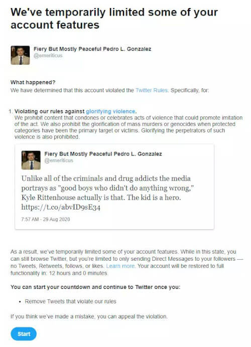

Twitter temporarily suspended Pedro Gonzalez (@emeriticus), assistant editor
for [American Greatness](https://amgreatness.com/), for tweeting that [Kyle
Rittenhouse](/context/kyle-rittenhouse/) is a hero:

> So this is the tweet that got my account locked temporarily. To start the
> countdown for unlocking an account, Twitter has you manually delete the
> offending tweet. Kind of funny, kind of a humiliating-dystopian-classroom
> vibe 
>
> -- Pedro L. Gonzalez (@emeriticus) [1 Sep 2020](https://archive.is/Ov6Z8)
