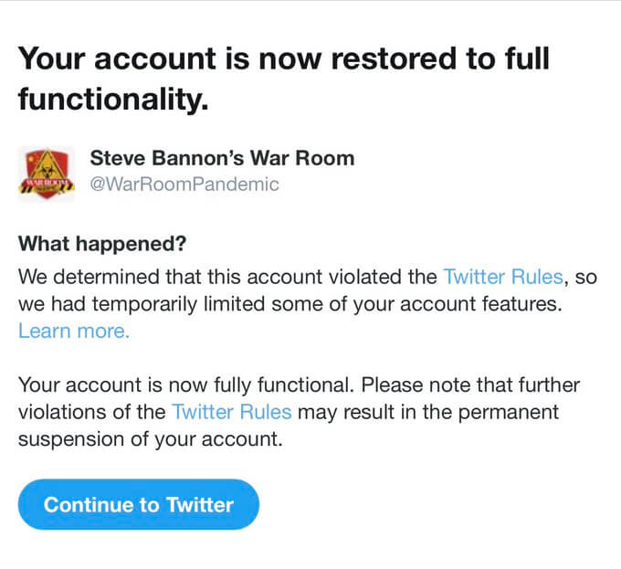

[Twitter](/twitter/) temporarily suspended the account of _Steve Bannon's War
Room_ for 12 hours on the night of the US 2020 Presidential Election. [The
reason](notice.jpg) was simply "violating the Twitter Rules."

> Twitter has locked the @WarRoomPandemic account for 12 hours.
>
> Prepare for full censorship.
>
> -- Raheem Kassam (@RaheemKassam) [3 Nov 2020](https://archive.is/JcQ1Y)

> Perrrrfect timing. :eyes:
>
> 
>
> -- Steve Bannon’s War Room (@WarRoomPandemic) [4 Nov 2020](https://archive.is/TaR5v)
