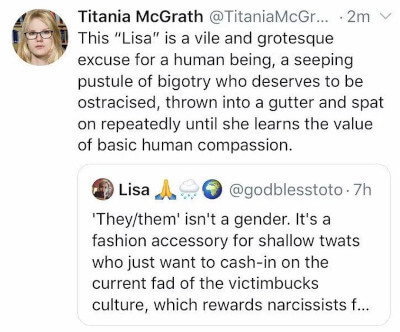

Twitter gave a one week suspension to Titania McGrath, a satirical SJW account
run by comedian Andrew Doyle:
> So @TitaniaMcGrath has been suspended for 7 days for pretending to slag me
> off in this tweet.
>
> Oh Twitter, never change... :joy:
>
> 
>
> -- Lisa (@godblesstoto) [15 Sep 2019](https://archive.is/WcoRd)

"Titania" issued the following [statement](statement.jpg) on the suspension:
> The fascists at Twitter have suspended my account for 7 days for the crime of
> resisting hate and fighting for social justice. Like Nelson Mandela, I have
> been silenced for speaking truth to power. I think he was banned from Twitter
> as well.
>
> They are right to fear me. I am dismantling the patriarchy, one tweet at a
> time. I am obliterating Nazis with my devastating hashtags. I am standing up
> for minorities who haven’t had the necessary education to know what their
> opinions should be.
>
> I am oppressed in so many ways. I am oppressed by the patriarchy because I am
> a woman. I am oppressed by restaurants that fail to offer a decent range of
> vegan options. I am oppressed by white people because I am hay-racial (my
> racial identity flucuates according to the pollen count). Now I am being
> oppressed by Twitter.
>
> I have always supported censorship of those who have the wrong opinions. But
> to censor my wisdom is an act that should be classified as a form of
> intellectual genocide. But I shall rise again.
>
> For I am justice. I am truth. I am Titania McGrath.
