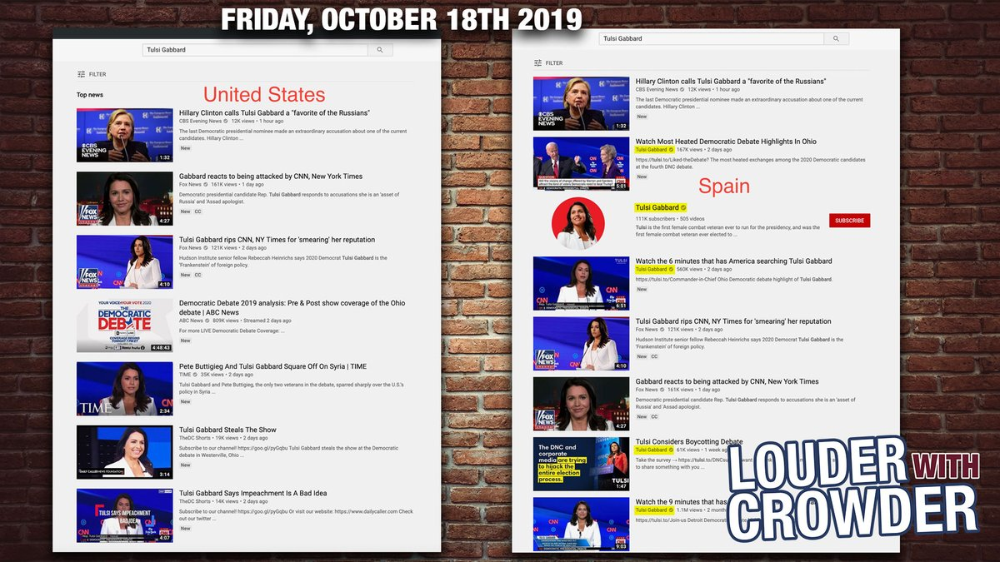

On September 30, Steven Crowder [released evidence](/events/crowder-confirms-youtube-shadow-ban/) that YouTube was shadow banning his channel exclusively in the US.
He warned that if this was being done to his channel, then this could easily be done to other channels.

Only two and a half weeks later, Presidential candidate [Tulsi Gabbard](https://www.tulsi2020.com/) was smeared by Hillary Clinton when she said that Tulsi is being groomed by the Russians to be a third party candidate.
[Tulsi's response on Twitter](https://twitter.com/TulsiGabbard/status/1185289626409406464) caused her to trend at #1.

However, at this same time, if you searched "tulsi gabbard" on YouTube, her channel, along with any videos from her channel, wouldn't appear until well after the first page of search results.

On Sunday October 20th, after Tulsi's trending started to die down, the YouTube search results went back to normal (this [according to Crowder](https://www.louderwithcrowder.com/breaking-youtube-election-meddling-of-tulsi-gabbard/)).

This means that Tulsi Gabbard was secretly censored by YouTube at the time when her name was most searched for.
If this sounds familiar, it's because nearly the same exact thing happened to Tulsi [back in June](https://www.breitbart.com/tech/2019/07/25/tulsi-gabbard-sues-google-for-censorship-of-ads/) when Google suspended her Google Ads account, without warning, after the first Democratic debate when she was _the most searched for candidate_.

A quote [from Crowder](https://www.bitchute.com/video/-T0RyYMSNWc/) sums this situation up pretty well:
> The influence that BigTech has, and their willingness to manipulate information, in the face of what should be a democratic election, regardless of whether it's happening to someone I support or not, is terrifying.
