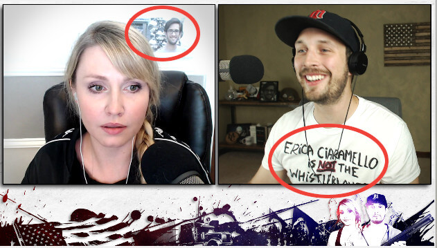
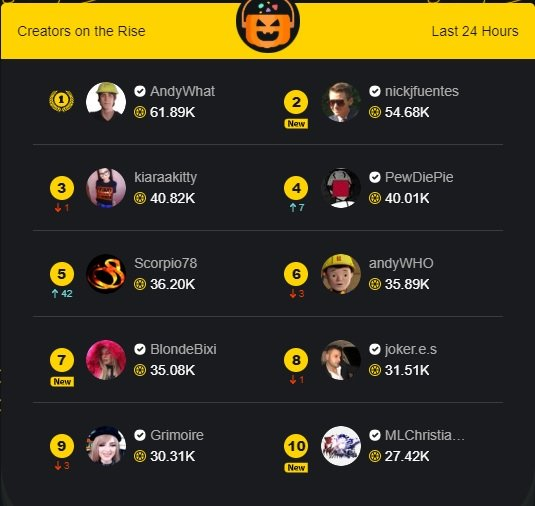

During the past week, YouTube and Facebook [started to purge any
content](/e/facebook-youtube-purge-mentions-of-eric-ciaramella-as-alleged-whistleblower/)
that mentions Eric Ciaramella as the alleged Trump-Ukraine whistleblower.
Among the content that was removed was Beauty and the Beta Sunday stream from
November 3rd.

When asked why content was removed, YouTube provided incredibly vague
instructions on how to santize certain content so that it could be republished.
In response, Matt and Blonde made a couple of minor adjustments for [the Sunday
stream on November 11th](https://www.bitchute.com/video/W5ifp4nPNJ63/).

Reaching perhaps the pinnacle of trolling genuis, Blonde put a picture of Eric
Ciaramella on the wall behind her and Matt wore a t-shirt that said "ERIC**A**
CIARAMELLA IS **NOT** THE WHISTLEBLOWER":

About 35 minutes in, YouTube pulled the stream. Immediately afterwards,
YouTube sent Matt the same exact email they had sent a few days prior:

> They sent me the same idiotic generic email
> [[image]](email-from-youtube.png)
>
> -- Matt Christiansen (@MLChristiansen) [10 Nov 2019](https://web.archive.org/web/20191111025447/https:/twitter.com/MLChristiansen/status/1193720165176791040)

This of course hilariously backfired in spectacular fashion. The stream had a
very successful night overall, despite the obstruction from YouTube.

Most importantly, Matt and Blonde were able to grow their DLive community as
one of DLive's top trending streams:

> Thanks to you guys, we were one of DLive's top trending streams for the last
> 24 hours.
>
> Remember no matter what bullshit YouTube tries, there is always a backup over
> there, and now a bigger community too!
>
> http://dlive.tv/mlchristiansen
>
> 
>
> -- Matt Christiansen (@MLChristiansen) [10 Nov 2019](https://web.archive.org/web/20191111052512/https:/twitter.com/MLChristiansen/status/1193760661622280193)
