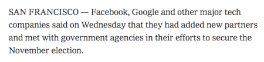

YouTube announced in a blog post how the platform would be "supporting
elections" moving forward. The post listed the different types of content that
would be removed, including that which [contains "hacked
information"](http://archive.is/Yfqg9#selection-1153.0-1153.279):
> Removing content that contains hacked information, the disclosure of which
> may interfere with democratic processes, such as elections and censuses. For
> example, videos that contain hacked information about a political candidate
> shared with the intent to interfere in an election.

In covering this, _Reclaim The Net_ gave a [great
example](http://archive.is/Ow4CD#selection-425.0-425.286) that shows the
obvious absurdity of a policy like this:
> Here’s an example of how this could work: say a candidate had committed
> murder – but this fact only surfaced thanks to a “hacking” effort,
> Google/YouTube would block that information, and leave its users/voters in
> the dark. So – who would be interfering with the democratic process now?

Not coincidentally, just one day prior, the New York Times reported on several
BigTech platforms meeting with government agencies in order to "secure" the
November election. They immediately started sanitizing the article.
> Monopolistic tech companies which collaborate in unison with government
> agencies to prevent unauthorized narratives from circulating on the internet
> are conducting state censorship. Own it.
> 
>
> -- Caitlin Johnstone (@caitoz) [12 Aug 2020](http://archive.is/hlU0g)
