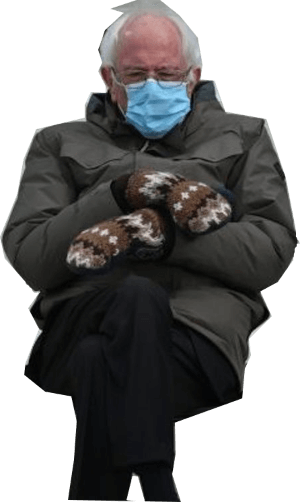

In [an interview a few days ago](https://archive.is/VDzVC), Bernie Sanders was
asked if the liberals have become "too willing to use their cultural and
corporate and political power to censor or suppress ideas and products that
offend them." After [sprinkling in a little Trump Derangement
Syndrome](https://archive.is/VDzVC#selection-2247.0-2247.172), the Senator from
Vermont said [the
following](https://archive.is/VDzVC#selection-2243.0-2255.178):

> [Trump] is a bad-news guy. But if you’re asking me, do I feel particularly
> comfortable that the then-president of the United States could not express
> his views on Twitter? I don’t feel comfortable about that.
>
> [...] Because yesterday it was Donald Trump who was banned, and tomorrow, it
> could be somebody else who has a very different point of view.

His response is sort of the opposite of what [he
said](https://archive.is/YTZu2) a few days after Trump was banned from
everything, but hey, principles. While this exchange got a relatively solid
amount of news coverage, everything seemed to underreport or leave out one
ironic fact: **it already has been, as Bernie says, "somebody else who has a
very different point of view!"** Forget the fact that Sanders' supporters seem
to get suppressed whenever the Democratic party is in the process of shafting
him (right around every presidential primary season, hmm). Let's just examine
the time period _after Trump was banned from nearly every major social media
platform_ to see if this scenario played out. Was there left wing individuals
who got suppressed or censored online after Trump was banned?

Absolutely, and the timing is nothing short of comical. Literally **the day
after the inauguration of President Biden**, [Twitter removed several
far-left/Antifa accounts](/e/twitter-removes-several-far-left-accounts/)
(@TheBaseBK, @JewishWorker, @RevAbolition, @RevAbolitionNYC to name a few),
probably because they were no longer a useful political tool now that Biden was
officially in power.

Almost a week later, [Facebook banned several of the
leaders](https://archive.is/wan8M) from the _World Socialist Web Site_,
_Socialist Equality Party_, and _International Youth & Students for Social
Equality_, although these bans turned out to just be an "error" and were
reversed a few days later.

> Last week, on my show, an editor from the WSWS cheered on Censoring his
> political opponents from social media. I pointed out censorship would soon be
> used against him. Facebook banned WSWS over the weekend. 
>
> That’s why U don’t use fascism to fight fascism
>
> -- Jimmy Dore (@jimmy_dore) [27 Jan 2021](https://archive.is/iTBrG)

About a week after that, YouTube demonetized a slew of left-wing outlets and
individuals including [Graham Elwood](/e/youtube-demonetizes-graham-elwood/),
[The Progressive Soapbox](/e/youtube-demonetizes-the-progressive-soapbox/),
[The Convo Couch](/e/youtube-demonetizes-the-convo-couch/), [Niko
House](/e/youtube-demonetizes-niko-house/), and so many more.

> YouTube Financially Deplatforms Swath Of Indie Media Accounts
>
> YouTube has demonetized progressive commentators @grahamelwood,
> @theProgSoapbox, @theconvocouch and @B43Franco, as well as freelancer
> @FordFischer who films US political demonstrations.
>
> -- Caitlin Johnstone (@caitoz) [3 Feb 2021](https://archive.is/fPzOZ)

In the beginning of this month, progressive outlet _Hard Lens Media_ [was
suspended from YouTube](https://yewtu.be/watch?v=cOv4SnJdrHk) for one week due
to a two month old video violating policies against "spam, deceptive practices,
and scams." The appeal was immediately rejected.

Keep in mind that this is just the time period from after Trump being mass
banned to now. Plus, I just wanted to illustrate the irony of censorship being
turned on leftists in particular. This doesn't even account for the
suppressions of [non-partisan individuals](https://archive.is/NQ2an),
libertarians (aka. ["domestic terrorists"](https://archive.is/FQxgK)), people
who don't have large followings, and creepy suppressions like [Twitter removing
accounts that "undermine faith in
NATO."](/e/twitter-removes-accounts-undermine-faith-in-nato/) I don't want this
article from becoming unbearably repetitive and borderline unreadable, so
suffice to say, this is the tip of the ice berg.

---

So what's really going on here? Does a sitting U.S. Senator seriously not know
that some of his most ardent supporters (or former supporters) were hit with
suppression tactics immediately following Trump's ban? Or, more broadly, that
swaths of his supporters are suppressed everytime he's winning against the
Democratic establishment?

Of course he knows. He's a politician and a grifter.

