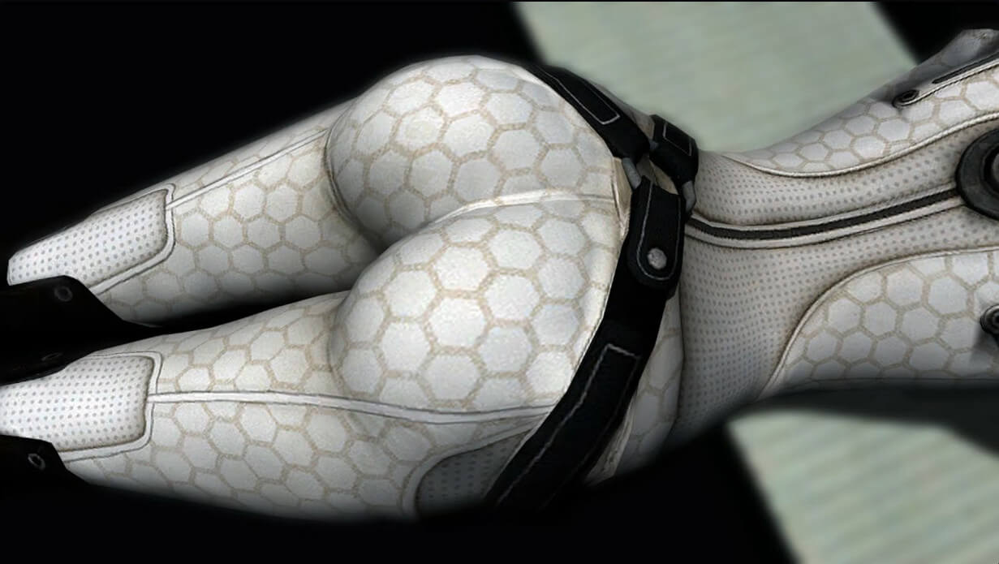

[_Upper Echelon Gamers_](https://odysee.com/@UpperEchelonGamers:3) is a gaming
organization which, among other things, publishes videos about current events
and topics particularly within (but not limited to) the gaming community. Its
founder, an individual who goes by the username Sanctionite, seems to be at the
very least a savvy content creator. He has built the _Upper Echelon_ YouTube
channel from nothing to over 440k subscribers and nearly 100 million total
views in less than five years.

For the past year, Sanctionite was able to "self-certify" the ad safety of
_Upper Echelon's_ videos, an ability which [he
explains](https://odysee.com/@UpperEchelonGamers:3/the-absolute-pathetic-state-of-youtube:0?r=EhKF687KFRkUkPRipjTapH5F6ouFKogB&t=141)
as follows:

> [...] YouTube employs a system where creators can self-certify videos and say
> whether or not they are 'safe' for ads or 'not safe' for ads. If you use it
> accurately, they allow you to choose. If you don't, they rely on the
> automated system, which is horrible and often screws channels over.

That last part is key: [self-certification](https://archive.is/W1Gv0) is an
extremely valuable tool for creators who know how to use it because it helps
them avoid the hellscape of YouTube's highly corporatized automation. Knowing
this, Sanctionite self-certified his videos with an abundance of caution so as
not to lose this ability:

> I would often put "limited ads" on my own videos... I tried very hard to be
> accurate in these ratings.

Unfortunately, he did lose it after publishing a video titled [_The Legendary
mASS Effect
Idiocy_](https://odysee.com/@UpperEchelonGamers:3/the-legendary-mass-effect-idiocy:d).
This video covered how the remastered edition of the video game _Mass Effect_
would no longer contain certain close up scenes of a female character's
volumptuous ass. While the video showed a few screenshots for context, the vast
majority of it [focused
on](https://odysee.com/@UpperEchelonGamers:3/the-legendary-mass-effect-idiocy:d?r=EhKF687KFRkUkPRipjTapH5F6ouFKogB&t=97)
the absurd and hypocritical reaction by gaming media and journalists:

> The original Mass Effect series featured a character called Miranda. Miranda
> has a brick house ass, and several camera angles in the original material
> showcase that to the audience. Does it make or break the game? No. Does it
> appeal to some players? Yes. Does it need to be the focal point of six
> hundred gaming news articles in a week long outrage campaign? No. No it does
> not.

That didn't matter though, because the video was flagged for violations of
YouTube's "nudity and sexual content policies", and this decision **_was even
upheld upon manual review_** at YouTube. Unsurprisingly, the _Upper Echelon_
channel saw several more absurd demonetizations in the following weeks due to
the fact that YouTube was automatically determining the ad safety of the videos
instead of Sanctionite self-certifying them. The video released after the _mASS
Effect_ one was titled [_The Moral Paradox of Canceling Disney
Plus_](https://odysee.com/@UpperEchelonGamers:3/the-moral-paradox-of-canceling-disney:e?r=EhKF687KFRkUkPRipjTapH5F6ouFKogB&t=219),
and it covered online reactions to Gina Carano being fired for a social media
post. This video was _also_ demonetized despite Sanctionite asking YouTube
_within the video itself_ to review it fairly:

> Basically, Gina Carano [...] posted a paragraph to one of her social medias
> reading as follows. Warning: there's some rather intense language here.
> Also, whoever reviews this video manually at YouTube, what's up? Hi! Yes,
> hello! I feel I should read the quote verbatim to properly communicate the
> subject matter, but in context, can we please look at this fairly and maybe
> not demonetize? Thanks.

Eventually, he made a video titled [_The Absolute Pathetic State of
YouTube_](https://odysee.com/@UpperEchelonGamers:3/the-absolute-pathetic-state-of-youtube:0)
which pointed out the absurdity of YouTube flagging one of his videos due to a
few screenshots from a video game, while at the same time allowing entire
categories of videos such as _naked news_ and _naked yoga_ to remain on the
platform. More importantly though, he also pointed out how some of the ads
currently running on YouTube are [very pornographically
suggestive](https://archive.is/YrBm9) and [have even been a
problem](https://archive.is/K0MV3) as far back as two years ago [when _YouTube
acknowledged the problem themselves_](https://archive.is/yPGS2). This video was
also demonetized because a few sexual words such as "porn" and "sex" were still
visible in the violative content being discussed despite the fact that all
images were blurred. And this is where we reach the pinnacle of YouTube's
ludicrousness: some _Upper Echelon_ videos, particularly this one pointing out
the violative content and ads that remain on YouTube, were flagged, and yet
YouTube continues to run these quasi-pornographic ads **even on _Upper
Echelon's_ videos!**

> Youtube demonetized my video for "sexual content" while advertising literal
> fetish porn cartoons on it. You cannot make this shit up.
>
> -- Upper Echelon Gaming (@UE_UpperEchelon) [9 Mar 2021](https://archive.is/3xu0n)

What's worse is that this **is not an isolated issue** in regards to the _Upper
Echelon_ channel being mistreated. The first page of [a simple keyword search
on
YouTube](https://www.youtube.com/results?search_query=disgusting+ads+on+youtube)
contains several videos of [content creators
discussing](https://www.youtube.com/watch?v=LDBXYPOhTY4) this [exact same
problem on YouTube](https://www.youtube.com/watch?v=yFgsd-rliEg), going back
[nearly a year](https://www.youtube.com/watch?v=nVsUUcXTY3A), and pointing out
that the ads even run on channels clearly meant for younger audiences. Some
even mentioned how simply talking about this could get their videos
demonetized. Additionally, a [simple search on
Reddit](https://www.reddit.com/search/?q=toomics) yields numerous
[posts](https://archive.is/0nb6B) of [people
complaining](https://archive.is/A2ALB) about getting [these types of
ads](https://archive.is/0FVaX). There's even [one that was
posted](https://archive.is/5B6ce) just a few days after the _Upper Echelon_
video that [highlighted this double
standard](https://odysee.com/@UpperEchelonGamers:3/the-absolute-pathetic-state-of-youtube:0?r=EhKF687KFRkUkPRipjTapH5F6ouFKogB&t=197):

> If news anchors can just strip, on camera, with nudity in the thumbnail of
> the video, and edited sections that directly focus on the nudity aspect,
> violating ToS, categorically, and be allowed on the platform with no
> sanctions, or if actual taboo and fetish cartoon pornography can be
> advertised on my own videos [...], they damn well have no grounds to
> demonetize anything I have ever created in my entire life.

Fortunately, after some time, Sanctionite was able to meet with his account
manager at YouTube who not only tried to rectify the situation as best they
could, but also had previously spent time examining and removing much of the
violative content highlighted in the previous videos. Sadly, nothing could be
done about Sanctionite losing the ability to self-certify. Creators can get
this ability back, but only after a significant period of time or a significant
number of new videos without any getting flagged, so hopefully this might be
resolved in the long run.

---

I don't think these types of problems on YouTube are going away because I don't
think that YouTube as a corporation views them as problematic, or at least not
enough so to meaningfully address them. There might be good people, such as
account managers, who try their best to fix some of the issues that come to
their attention, but even then there is only so much they can do. Therefore, I
think it'd be more accurate to say that these issues, and the trouble one must
go through to resolve them, have become an inherent part of YouTube as a
platform.

So if YouTube isn't going to change, what can we do? Well if you're a content
creator, consider using alternative video hosting platforms! Most (if not all)
provide some type of tool that allows you to automatically mirror your entire
video library from YouTube.  In other words, whenever you upload a video on
YouTube, it'll automatically upload to the new platform as well. Not only will
this serve as a contingency in case YouTube's automation starts messing with
your channel, but it could also be rewarding in its own right. For example,
creators and viewers on Odysee both earn cryptocurrency for using the platform.
Futhermore, especially if you are a content creator who is just getting
started, you could possibly experience quicker and more sustained growth than
you would on YouTube nowadays.

The trend towards new & alternative technology is real and [continually growing
stronger](/t/alttech-growth/) for many reasons. These newer platforms are
already innovating at a greater rate than BigTech because they focus on
improving their own sites instead of over-policing them. This trend will only
accelerate if corporations like YouTube continue to rely so heavily on their
clearly flawed automation which results in the mistreatment of quality channels
like _Upper Echelon Gamers_.
